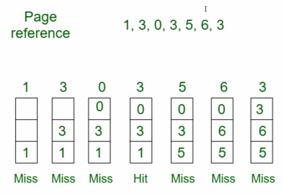
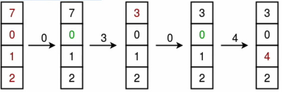

# 페이지 교체 알고리즘

스와핑이 발생할 때 페이지 교체 알고리즘에 의해 페이지가 교체됨

## 오프라인 알고리즘

- LFD, Longest Forward Distance
- 페이지 교체 알고리즘 중 가장 좋은 알고리즘
- 더 이상 참조되지 않거나, 가장 늦게 다시 참조되는 페이지와 지금 요청된 페이지를 바꾸는 알고리즘
  
- 처음에 1,2,3 그리고 가장 나중에 참조되는 3을 내보내고 4, 그리고 1,2는 원래 있고 4는 다시 참조되지 않으므로 4 내보내고 5, 그리고 1,2 있고 3뒤에 아무 계획 없으므로 1,2,5 중에 아무거나 내보내서 3 올리기
- 하지만 사실상 구현할 수 없는 알고리즘(미래 예측을 해야하기 때문)
- 상한선을 제시하는 알고리즘으로 사용(다른 알고리즘이 LFD에 비해 어느 정도의 성능을 내는지)

## FIFO

- 가장 먼저 온 페이지부터 교체

## LRU

- Least Recently Used
- 최근에 사용되지 않은 페이지를 바꾸는 방법
  
- 7 0 1 2 0 3 0 4

## NUR

- Not Used Recently(Not Recently Used)

- Clock 알고리즘
- 한 바퀴 돌 동안 사용되지 않은면 0
- 시계 방향으로 돌면서 0을 찾은 순간 페이지 교체하고 해당 부분을 1로 바꿈

## LFU

- Least Frequently Used
- 가장 참조횟수가 적은 페이지 교체
- 0,1,2,0,0,1,2,3
  
- 참조 횟수(0:3, 1:2, 2:2)가 가장 적은 페이지들 중에서 하나랑 교체
